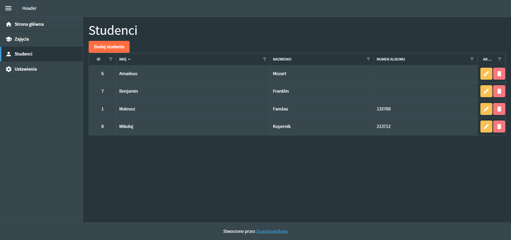

# Students Blazor

Sample app for teacher to manage students, his classes and grades.

Stack:
* Blazor Server Side
* Entity Framework Core
* Radzen - UI Library [https://blazor.radzen.com](https://blazor.radzen.com)

It's sample app to try out Blazor Server Side, relatively new framework from Microsoft.

I am using server side version here, coz I wanted to try out easy integration with backend.

